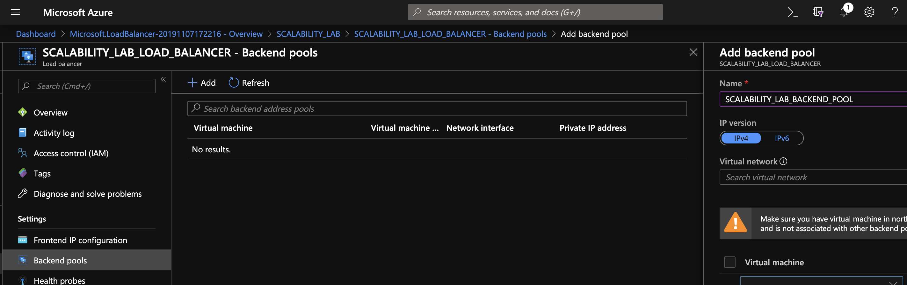
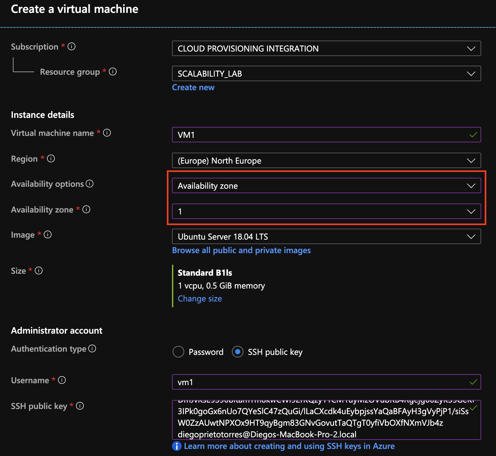

### Escuela Colombiana de Ingeniería
### Arquitecturas de Software - ARSW

## Escalamiento en Azure con Maquinas Virtuales, Sacale Sets y Service Plans

### Dependencias
* Cree una cuenta gratuita dentro de Azure. Para hacerlo puede guiarse de esta [documentación](https://azure.microsoft.com/en-us/free/search/?&ef_id=Cj0KCQiA2ITuBRDkARIsAMK9Q7MuvuTqIfK15LWfaM7bLL_QsBbC5XhJJezUbcfx-qAnfPjH568chTMaAkAsEALw_wcB:G:s&OCID=AID2000068_SEM_alOkB9ZE&MarinID=alOkB9ZE_368060503322_%2Bazure_b_c__79187603991_kwd-23159435208&lnkd=Google_Azure_Brand&dclid=CjgKEAiA2ITuBRDchty8lqPlzS4SJAC3x4k1mAxU7XNhWdOSESfffUnMNjLWcAIuikQnj3C4U8xRG_D_BwE). Al hacerlo usted contará con $200 USD para gastar durante 1 mes.

### Parte 0 - Entendiendo el escenario de calidad

Adjunto a este laboratorio usted podrá encontrar una aplicación totalmente desarrollada que tiene como objetivo calcular el enésimo valor de la secuencia de Fibonnaci.

**Escalabilidad**
Cuando un conjunto de usuarios consulta un enésimo número (superior a 1000000) de la secuencia de Fibonacci de forma concurrente y el sistema se encuentra bajo condiciones normales de operación, todas las peticiones deben ser respondidas y el consumo de CPU del sistema no puede superar el 70%.

### Parte 1 - Escalabilidad vertical

1. Diríjase a el [Portal de Azure](https://portal.azure.com/) y a continuación cree una maquina virtual con las características básicas descritas en la imágen 1 y que corresponden a las siguientes:
    * Resource Group = SCALABILITY_LAB
    * Virtual machine name = VERTICAL-SCALABILITY
    * Image = Ubuntu Server 
    * Size = Standard B1ls
    * Username = scalability_lab
    * SSH publi key = Su llave ssh publica


2. Para conectarse a la VM use el siguiente comando, donde las `x` las debe remplazar por la IP de su propia VM.

    `ssh scalability_lab@xxx.xxx.xxx.xxx`

3. Instale node, para ello siga la sección *Installing Node.js and npm using NVM* que encontrará en este [enlace](https://linuxize.com/post/how-to-install-node-js-on-ubuntu-18.04/).
4. Para instalar la aplicación adjunta al Laboratorio, suba la carpeta `FibonacciApp` a un repositorio al cual tenga acceso y ejecute estos comandos dentro de la VM:

    `git clone <your_repo>`

    `cd <your_repo>/FibonacciApp`

    `npm install`

5. Para ejecutar la aplicación puede usar el comando `npm FibinacciApp.js`, sin embargo una vez pierda la conexión ssh la aplicación dejará de funcionar. Para evitar ese compartamiento usaremos *forever*. Ejecute los siguientes comando dentro de la VM.

    `npm install forever -g`

    `forever start FibinacciApp.js`

6. Antes de verificar si el endpoint funciona, en Azure vaya a la sección de *Networking* y cree una *Inbound port rule* tal como se muestra en la imágen. Para verificar que la aplicación funciona, use un browser y user el endpoint `http://xxx.xxx.xxx.xxx:3000/fibonacci/6`. La respuesta debe ser `The answer is 8`.


7. La función que calcula en enésimo número de la secuencia de Fibonacci está muy mal construido y consume bastante CPU para obtener la respuesta. Usando la consola del Browser documente los tiempos de respuesta para dicho endpoint usando los siguintes valores:
    * 1000000
    * 1010000
    * 1020000
    * 1030000
    * 1040000
    * 1050000
    * 1060000
    * 1070000
    * 1080000
    * 1090000    

8. Dírijase ahora a Azure y verifique el consumo de CPU para la VM. (Los resultados pueden tardar 5 minutos en aparecer).


9. Ahora usaremos Postman para simular una carga concurrente a nuestro sistema. Siga estos pasos.
    * Instale newman con el comando `npm install newman -g`. Para conocer más de Newman consulte el siguiente [enlace](https://learning.getpostman.com/docs/postman/collection-runs/command-line-integration-with-newman/).
    * Diríjase hasta la ruta `FibonacciApp/postman` en una maquina diferente a la VM.
    * Para el archivo `[ARSW_LOAD-BALANCING_AZURE].postman_environment.json` cambie el valor del parámetro `VM1` para que coincida con la IP de su VM.
    * Ejecute el siguiente comando.

    ```
    newman run ARSW_LOAD-BALANCING_AZURE.postman_collection.json -e [ARSW_LOAD-BALANCING_AZURE].postman_environment.json -n 10 &
    newman run ARSW_LOAD-BALANCING_AZURE.postman_collection.json -e [ARSW_LOAD-BALANCING_AZURE].postman_environment.json -n 10
    ```

10. La cantidad de CPU consumida es bastante grande y un conjunto considerable de peticiones concurrentes pueden hacer fallar nuestro servicio. Para solucionarlo usaremos una estrategia de Escalamiento Vertical. En Azure diríjase a la sección *size* y a continuación seleccione el tamaño `B2ms`.


11. Una vez el cambio se vea reflejado, repita el paso 7, 8 y 9.
12. Evalue el escenario de calidad asociado al requerimiento no funcional de escalabilidad y concluya si usando este modelo de escalabilidad logramos cumplirlo.
13. Vuelva a dejar la VM en el tamaño inicial para evitar cobros adicionales.

**Preguntas**

1. ¿Cuántos y cuáles recursos crea Azure junto con la VM?

    1. Interfaz de red.
    2. Dirección IP Pública.
    3. Disco.
    4. Red Virtual.
    5. Cuenta de almacenamiento.
    6. Grupo de Seguridad de la Red.
    
    
2. ¿Brevemente describa para qué sirve cada recurso?

    1. ***Interfaz de Red***: Las interfaces de red se utilizan para configurar direcciones IP, configuraciones de red virtual y servidores DNS que se asignarán a una máquina virtual. Microsoft Azure admite la conexión de múltiples interfaces de red (NIC) a una máquina virtual para una flexibilidad adicional en las opciones de conectividad de red.
    2. ***Dirección IP Pública***: es una dirección IP dinámica o estática que puede asignar a máquinas virtuales, equilibradores de carga y puertas de enlace de red virtual para comunicarse con Internet. Sus direcciones IP públicas están asociadas con su suscripción de Azure y se pueden mover libremente entre los recursos de Azure.
    3. ***Disco***: Cada máquina virtual de Azure está conectada a al menos un disco para el sistema operativo y el almacenamiento persistente. Un disco puede ser una unidad estándar (HDD) o premium (SSD). Los discos creados con este método solo se pueden usar con máquinas virtuales clásicas.
    4. ***Red Virtual***: Azure Virtual Network (VNet) es el bloque de creación fundamental de una red privada en Azure. VNet permite muchos tipos de recursos de Azure, como Azure Virtual Machines (máquinas virtuales), para comunicarse de forma segura entre usuarios, con Internet y con las redes locales.
    5. ***Cuenta de almacenamiento***: Azure Storage es un servicio administrado por Microsoft que proporciona almacenamiento en la nube altamente disponible, seguro, duradero, escalable y redundante.
    6. ***Grupo de Seguridad de la Red***: Un grupo de seguridad de red es una capa de seguridad que actúa como un firewall virtual para controlar el tráfico de entrada y salida de máquinas virtuales (a través de interfaces de red) y subredes. Contiene un conjunto de reglas de seguridad que permiten o niegan el tráfico entrante y saliente utilizando las siguientes 5 tuplas: protocolo, rango de dirección IP de origen, rango de puerto de origen, rango de dirección IP de destino y rango de puerto de destino.
    
    
3. ¿Al cerrar la conexión ssh con la VM, por qué se cae la aplicación que ejecutamos con el comando `npm FibonacciApp.js`? ¿Por qué debemos crear un *Inbound port rule* antes de acceder al servicio?

    + La conexión por shh funciona por sesión, en el momento en el que nos conectamos la sesión mantiene los procesos que ejecutamos en los recursos, sin esta todos ellos se terminan (también los subprocesos).

    + La inbound port rule es importante para permitir el tráfico a través de un puerto y protocolo específico (UDP o TCP).
    
    
4. Adjunte tabla de tiempos e interprete por qué la función tarda tando tiempo.

    
    
    

    En este caso el algoritmo de fibonacci no está implementado de la mejor forma y su tiempo de ejecución tarda demasiado, a esto se le suma latencia entre la conexión del cliente y los servidores intermediarios necesarios.

5. Adjunte imágen del consumo de CPU de la VM e interprete por qué la función consume esa cantidad de CPU.

    
    
    El cosumo de CPU es bastante alto debido a que la implementación del fibonacci está ocupando demasiados recursos en este caso con un procesador sencillo y un algoritmo sin ningun tipo de memoization es muy facil consumirse los recursos.
    
6. Adjunte la imagen del resumen de la ejecución de Postman. Interprete:
    * Tiempos de ejecución de cada petición.
    * Si hubo fallos documentelos y explique.
    
    
   
    

    
7. ¿Cuál es la diferencia entre los tamaños `B2ms` y `B1ls` (no solo busque especificaciones de infraestructura)?
    
    

    Como se puede ver en la imagen, la capacidad del B2ms es mucho mas superior, al igual que su costo, esto permite que la aplicación tenga muchos mas recursos disponibles.
    
8. ¿Aumentar el tamaño de la VM es una buena solución en este escenario?, ¿Qué pasa con la FibonacciApp cuando cambiamos el tamaño de la VM?

En este escenario se han tenido en cuenta los tiempos de respuesta y la cantidad de peticiones a procesar, netamente hablando de peticiones simultaneas esta es una solución viable. Pero por el lado del tiempo de respuesta no hay mucho que esta solución nos pueda proveer.


9. ¿Qué pasa con la infraestructura cuando cambia el tamaño de la VM? ¿Qué efectos negativos implica?

Se detiene el servicio y se debe reiniciar la maquina lo que implica que se pierde disponibilidad y hay que correr los servicios de nuevo.


10. ¿Hubo mejora en el consumo de CPU o en los tiempos de respuesta? Si/No ¿Por qué?

    
    
    Hubo una mejora en el consumo de CPU como se puede ver en la imagen, la mejora se debe a que el disco tiene mayor capacidad de procesamientdos lo que permite que las conexiones no se cierren y la aplicación soporte más cálculos por segundo.
    
11. Aumente la cantidad de ejecuciones paralelas del comando de postman a `4`. ¿El comportamiento del sistema es porcentualmente mejor?

### Parte 2 - Escalabilidad horizontal

#### Crear el Balanceador de Carga

Antes de continuar puede eliminar el grupo de recursos anterior para evitar gastos adicionales y realizar la actividad en un grupo de recursos totalmente limpio.

1. El Balanceador de Carga es un recurso fundamental para habilitar la escalabilidad horizontal de nuestro sistema, por eso en este paso cree un balanceador de carga dentro de Azure tal cual como se muestra en la imágen adjunta.


2. A continuación cree un *Backend Pool*, guiese con la siguiente imágen.



3. A continuación cree un *Health Probe*, guiese con la siguiente imágen.


4. A continuación cree un *Load Balancing Rule*, guiese con la siguiente imágen.


5. Cree una *Virtual Network* dentro del grupo de recursos, guiese con la siguiente imágen.


#### Crear las maquinas virtuales (Nodos)

Ahora vamos a crear 3 VMs (VM1, VM2 y VM3) con direcciones IP públicas standar en 3 diferentes zonas de disponibilidad. Después las agregaremos al balanceador de carga.

1. En la configuración básica de la VM guíese por la siguiente imágen. Es importante que se fije en la "Avaiability Zone", donde la VM1 será 1, la VM2 será 2 y la VM3 será 3.



2. En la configuración de networking, verifique que se ha seleccionado la *Virtual Network*  y la *Subnet* creadas anteriormente. Adicionalmente asigne una IP pública y no olvide habilitar la redundancia de zona.


3. Para el Network Security Group seleccione "avanzado" y realice la siguiente configuración. No olvide crear un *Inbound Rule*, en el cual habilite el tráfico por el puerto 3000. Cuando cree la VM2 y la VM3, no necesita volver a crear el *Network Security Group*, sino que puede seleccionar el anteriormente creado.


4. Ahora asignaremos esta VM a nuestro balanceador de carga, para ello siga la configuración de la siguiente imágen.


5. Finalmente debemos instalar la aplicación de Fibonacci en la VM. para ello puede ejecutar el conjunto de los siguientes comandos, cambiando el nombre de la VM por el correcto

```
git clone https://github.com/daprieto1/ARSW_LOAD-BALANCING_AZURE.git

curl -o- https://raw.githubusercontent.com/creationix/nvm/v0.34.0/install.sh | bash
source /home/vm1/.bashrc
nvm install node

cd ARSW_LOAD-BALANCING_AZURE/FibonacciApp
npm install

npm install forever -g
forever start FibonacciApp.js
```

Realice este proceso para las 3 VMs, por ahora lo haremos a mano una por una, sin embargo es importante que usted sepa que existen herramientas para aumatizar este proceso, entre ellas encontramos Azure Resource Manager, OsDisk Images, Terraform con Vagrant y Paker, Puppet, Ansible entre otras.

#### Probar el resultado final de nuestra infraestructura

1. Porsupuesto el endpoint de acceso a nuestro sistema será la IP pública del balanceador de carga, primero verifiquemos que los servicios básicos están funcionando, consuma los siguientes recursos:

```
http://52.155.223.248/
http://52.155.223.248/fibonacci/1
```

2. Realice las pruebas de carga con `newman` que se realizaron en la parte 1 y haga un informe comparativo donde contraste: tiempos de respuesta, cantidad de peticiones respondidas con éxito, costos de las 2 infraestrucruras, es decir, la que desarrollamos con balanceo de carga horizontal y la que se hizo con una maquina virtual escalada.

3. Agregue una 4 maquina virtual y realice las pruebas de newman, pero esta vez no lance 2 peticiones en paralelo, sino que incrementelo a 4. Haga un informe donde presente el comportamiento de la CPU de las 4 VM y explique porque la tasa de éxito de las peticiones aumento con este estilo de escalabilidad.

```
newman run ARSW_LOAD-BALANCING_AZURE.postman_collection.json -e [ARSW_LOAD-BALANCING_AZURE].postman_environment.json -n 10 &
newman run ARSW_LOAD-BALANCING_AZURE.postman_collection.json -e [ARSW_LOAD-BALANCING_AZURE].postman_environment.json -n 10 &
newman run ARSW_LOAD-BALANCING_AZURE.postman_collection.json -e [ARSW_LOAD-BALANCING_AZURE].postman_environment.json -n 10 &
newman run ARSW_LOAD-BALANCING_AZURE.postman_collection.json -e [ARSW_LOAD-BALANCING_AZURE].postman_environment.json -n 10
```

**Preguntas**

* ¿Cuáles son los tipos de balanceadores de carga en Azure y en qué se diferencian?

    a. Public Load Balancer asigna la dirección IP pública y el puerto del tráfico entrante a la dirección IP privada y al puerto de la máquina virtual. 

    b. Internal Load Balancer dirige el tráfico sólo a los recursos que están contenidos en la red virtual.
 
   
* ¿Qué es SKU, qué tipos hay y en qué se diferencian?, ¿Por qué el balanceador de carga necesita una IP pública?
    
    **SKU(Stock Keeping Unit)**: Representa una unidad de mantenimiento de existencias comprable bajo un producto. ***Los tipos que existen son el básico y el estandar***. El SKU estándar tiene más características que el básico, unas cuantas diferencias son el soporte de mayor cantidad de instancias, soporte del protocolo HTTPS en sus Health Probes, la mayoría de las operaciones se realiza en menos de 30 segundos, pero no es gratis como el SKU básico.

    El balanceador de carga necesita una ***IP pública*** por que actúa como el único punto con el que los clientes interactúan con la aplicación, es el encargado de distribuir el tráfico entre varios nodos disponibles.
    
    
* ¿Cuál es el propósito del *Backend Pool*?

    **Backend Pool**: se refiere al conjunto de backends que reciben un tráfico similar para su aplicación. En otras palabras, es una agrupación lógica de las instancias de su aplicación en todo el mundo que reciben el mismo tráfico y responden con el comportamiento esperado. Estos "backends" se despliegan a través de diferentes regiones o dentro de la misma región. Todos los backends pueden estar en modo de despliegue Activo/Activo o lo que se define como configuración Activo/Pasivo.
    
    - **Propósito**: Definir cómo los diferentes backends deben ser evaluados a través de sondas de salud. También define cómo se produce el equilibrio de carga entre ellos.
    
* ¿Cuál es el propósito del *Health Probe*?

     La configuración de la sonda de salud y las respuestas de las sondas determinan qué instancias del conjunto del backend recibirán nuevos flujos. Puede utilizar sondas de salud para detectar el fallo de una aplicación en un punto final del backend.
     
     
* ¿Cuál es el propósito de la *Load Balancing Rule*? 
    
    Distribuir el tráfico que llega al front hacia los backend pools.


* ¿Qué tipos de sesión persistente existen, por qué esto es importante y cómo puede afectar la escalabilidad del sistema?.

    + **None (hash-based)**: Especifica que las solicitudes sucesivas del mismo cliente pueden ser manejadas por cualquier máquina virtual.
    
    + **Client IP (source IP affinity 2-tuple)**: Especifica que las peticiones sucesivas de la misma dirección IP del cliente serán gestionadas por la misma máquina virtual.
    
    + **Client IP and Protocol (Source IP affinity 3-tuple)**: Especifica que las solicitudes sucesivas de la misma combinación de dirección IP de cliente y protocolo serán tratadas por la misma máquina virtual.
    
    Indica la forma en que las peticiones deben comportarse al momento de llegar a el balanceador de carga, dependiendo de su configuración decide si esa petición se va a una máquina especifica o a una aleatoria. Afecta la escalabilidad en el sentido de que la configuración debe estar dada por el tipo de aplicación y servicio que se está ofreciendo.
    
* ¿Qué es una *Virtual Network*? 
    
    **Virtual Network**: Representación de una red propia en la nube. Es un aislamiento lógico de la nube de Azure dedicada a la suscripción del usuario. Puede utilizar VNets para aprovisionar y gestionar redes virtuales privadas (VPNs) en Azure y, opcionalmente, enlazar las VNets con otras VNets en Azure, o con una infraestructura de TI local.


* ¿Qué es una *Subnet*? 
    
    **Subnet**: Rango de direcciones lógicas. Al mantener una red de gran tamaño, es una buena estrategia dividirla en subredes para reducir el tamaño de dominios de broadcast y hacerla más fácil de administrar. En Azure la Subnet permite segmentar la red virtual en una o más subredes y asignar una parte del espacio de direcciones de la Virtual Network a cada subred.


* ¿Para qué sirven los *address space* y *address range*?

    **Address space**: Especifica un espacio de direcciones IP privado personalizado utilizando direcciones públicas y privadas. Azure asigna a los recursos en una red virtual una dirección IP privada desde el espacio de direcciones que se asigne.
    
    **Address range**: Rango de direcciones IP que se define a partir del address space.
    
    
* ¿Qué son las *Availability Zone* y por qué seleccionamos 3 diferentes zonas?. ¿Qué significa que una IP sea *zone-redundant*?

    **Zonas de Disponibilidad**: Son promesas de disponibilidad que protegen las aplicaciones y datos de los fallos del centro de datos. También son lugares físicos únicos dentro de una región de Azure.

    Se seleccionaron tres zonas de diferentes para no centralizar la aplicación en caso tal de que una de las zonas caiga debido a cualquier tipo de imprevisto.

    Que una IP sea ***zone redundant*** significa que todos los flujos entrantes o salientes son atendidos por múltiples zonas de disponibilidad en una región simultáneamente utilizando una esa sola dirección de IP.
    
* ¿Cuál es el propósito del *Network Security Group*?

    Se asegura de filtrar el tráfico de red hacia y desde los recursos Azure en una red virtual Azure con un grupo de seguridad de red. Continene reglas de seguridad que permiten o niegan el tráfico entrante a la red.

    
* Informe de newman 1 (Punto 2)
    
    + Experimento
        + Prueba de escalamiento vertical:
        
        
        
        + Consumo en la máquina que se escaló:
        
        

        + Prueba de escalamiento horizontal:
        
        
        
        + Consumo en las máquinas del grupo de balanceo de carga:
        
        
        
        
        
        
    + Tabla Comparativa
    
    | Escalamiento  |Instancia   | cantidad de Vm  |Tiempo de respuesta (min)  |Peticiones exitosas   | Horas disponible | Costo mensual |
    |---|---|---|---|---|---|---|
    |   vertical|  B1ms |  1 |  3 | 10  | 730  | 66.50 USD  |
    |   horizontal|  B1ls | 4  |  5 | 10  | 730 |  17.48 USD|
    
    + Conclusiones
    
    El escalamiento de un nodo en vertical, en este caso tiene una disminución en el tiempo de respuesta de al menos 2 minutos, sin embargo este comportamiento es variable, realmente la diferencia entre las dos opciones de escalamiento se ve fuertemente influenciada por la conexión con los servicios. Los dos experimentos tuvieron un comportamiento bueno con las peticiones, ninguna falló. Sin embargo la carga de procesamiento que se da en el escalamiento vertical no tiene el mejor comportamiento con las peticiones concurrentes, ventaja que si aprovecha el escalado horizontal gracias al balanceador de caraga, en el experimiento de la carga concurrente se pudo observar como se distribuyen las peticiones en las 4 máquinas. El coste mensual del escalamiento vertical es excesivo comparado con el escalamiento horizontal, en este caso concluimos que el escalamiento horizontal es la opción más viable.


* Presente el Diagrama de Despliegue de la solución.


